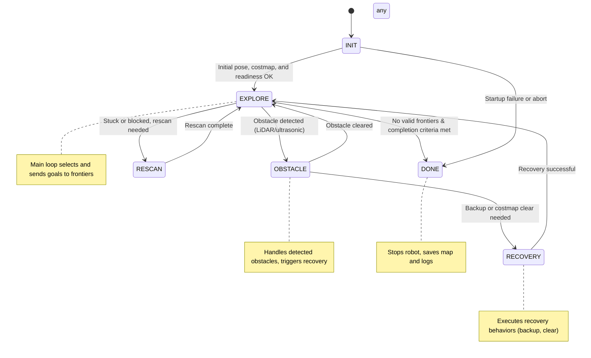

# FEA_SLAM Autonomous Exploration System

## Project Overview

This project implements a fully autonomous exploration system for mobile robots using ROS2. The system is designed to efficiently map unknown environments, handle obstacles, and recover from navigation failures, making it suitable for research, education, and real-world deployment in robotics.

---

## System Architecture

- **Core Node:** `ExplorationCoordinator` orchestrates the entire exploration process, integrating sensing, planning, execution, and persistence.
- **Mixins:**
  - `ExplorationSensingMixin`: Handles sensor data (LiDAR, ultrasonic, odometry, costmaps).
  - `ExplorationPlanningMixin`: Selects and validates frontiers, plans navigation goals.
  - `ExplorationExecutionMixin`: Manages state transitions, obstacle handling, and recovery.
  - `ExplorationPersistenceMixin`: Saves maps, paths, and exploration logs.
- **State Machine:**
  - `INIT`: Waits for initial pose and system readiness.
  - `EXPLORE`: Selects and sends goals to frontiers.
  - `OBSTACLE`: Handles detected obstacles.
  - `RESCAN`: Performs additional scans if stuck.
  - `RECOVERY`: Executes recovery behaviors (backup, costmap clear).
  - `DONE`: Stops robot and saves results.

---

## Main Flow

1. **Startup:**
   - Declares and reads all parameters (thresholds, timeouts, toggles, topics).
   - Waits for initial pose, costmap, and system health.
2. **Exploration:**
   - Continuously selects the best frontier based on map and sensor data.
   - Sends navigation goals to the Nav2 stack.
   - Monitors progress, map growth, and robot movement.
3. **Obstacle Handling:**
   - Detects obstacles using LiDAR and ultrasonic sensors.
   - Triggers backup, costmap clearing, or recovery as needed.
4. **Recovery:**
   - Executes recovery behaviors if stuck or blocked.
   - Rescans environment and retries navigation.
5. **Completion:**
   - Stops when no valid frontiers remain and completion criteria are met (coverage, goals, movement).
   - Saves map, path, and exploration logs.

---

## Key Parameters

- `nav2_timeout`, `obstacle_distance`, `backup_speed`, `backup_time`
- `use_lidar_obstacle`, `strict_obstacle_handling`, `use_ultrasonic_backup`
- `frontier_goal_offset`, `min_frontier_distance`, `frontier_lidar_range_m`
- `costmap_free_threshold`, `require_costmap`, `costmap_wait_timeout`
- `coverage_complete_percent`, `min_goals_for_complete`, `post_abort_goal_cooldown_sec`
- `auto_save_on_complete`, `map_save_dir`, `path_record_min_dist`
- All parameters are declared in a single defaults dictionary for easy tuning.

---

## System Flow Diagram

---

## Features

- **Frontier-based Exploration:** Efficiently explores unknown areas using dynamic frontier selection.
- **Robust Obstacle Handling:** Integrates LiDAR and ultrasonic sensors for real-time obstacle detection and avoidance.
- **Recovery Behaviors:** Automatic backup, costmap clearing, and rescan to escape dead-ends or dynamic obstacles.
- **Flexible Parameterization:** All behaviors and thresholds are easily configurable via parameters.
- **Persistent Logging:** Saves maps, robot paths, navigation goals, and exploration history for analysis and reproducibility.

---

## Applications

- Autonomous mapping and exploration in unknown or dynamic environments
- Research in SLAM, navigation, and multi-robot systems
- Educational robotics and hands-on learning
- Real-world deployment in warehouses, search-and-rescue, and more

---

## How to Use

1. **Configure Parameters:** Edit the defaults in `exploration_coordinator.py` or override via launch files.
2. **Launch the System:** Use the provided launch scripts to start all required nodes.
3. **Monitor Progress:** Visualize in RViz, check logs, and review saved maps and paths.
4. **Review Results:** All outputs are saved in the `saved_maps` directory for later analysis or sharing.

---

## Conclusion

The FEA_SLAM exploration system provides a robust, flexible, and fully autonomous solution for robotic mapping and navigation. Its modular design, rich parameterization, and persistent logging make it ideal for both research and practical deployment.
